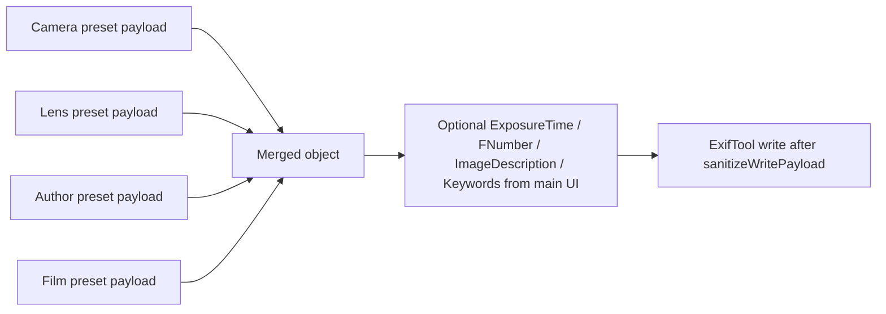

# EXIF tags, presets, and UI mapping

This document describes how EXIF tag names relate to **preset categories** (Camera, Lens, Film, Author), what gets **written to image files**, and where values appear in the **EXIFmod UI**.

Implementation references:

- Merge and sanitization: `src/main/exifCore/store.ts` (`mergeSelectedPayloads` strips `Film` / `Film Maker` only; **film preset** payloads are passed through `normalizeFilmPresetPayloadForMerge` from `src/shared/filmKeywords.ts` so merged `Keywords` always use the canonical `… Film Stock` token when a stock is inferable—matching Preset Editor save behavior even for legacy DB rows), `src/main/exifCore/pure.ts` (`sanitizeWritePayload` at ExifTool apply, `buildApplyCommand`), `src/shared/exifClearTags.ts` (tag lists for the metadata **Remove** row per category)
- Constants: `src/main/exifCore/constants.ts` (re-exports limits from `src/shared/exifLimits.ts`: `IMAGEDESCRIPTION_MAX_UTF8_BYTES`, keyword caps)
- Main grid / commit: `src/renderer/src/App.tsx` (`buildMergedPayloadForState`, metadata table, Notes + Keywords fields, shutter/aperture)
- Shared EXIF limits + merge helpers: `src/shared/exifLimits.ts` (UTF‑8 clamps, `mergeImageDescriptionAppend`, `fitKeywordsForExif`, `remainingUtf8BytesForAiDescription`), `src/shared/filmKeywords.ts` (`buildMergedKeywordsForWrite`, `mergeKeywordsDeduped`, `Film Stock` suffix helpers)
- Preview “what would change”: `src/renderer/src/exif/payloadDiff.ts` (`diffWritePayloadFromMetadata` vs last `exiftool -j` read)
- Preview + Ollama: `src/main/previewImage.ts` (640px max edge JPEG for the file list; **384px** max edge for Ollama vision input only), `src/main/ollamaConfig.ts` (loopback base URL, `**resolveOllamaModelName**` from `**EXIFMOD_OLLAMA_MODEL**` or default `gemma4`, chat `options` / env tunables), `src/main/ollamaDescribe.ts` (loopback-only `/api/chat` with `think: false` and bounded `options`; `**getDescribeSystemPrompt**` for the status bar; high-level-scene prompt; optional `maxDescriptionUtf8Bytes` from remaining ImageDescription space), `src/main/ollamaDescribePromptPrefs.ts` (optional custom describe system prompt in user data; `**{{MAX_DESC_BYTES}}**` in the template), `src/main/ollamaLifecycle.ts` (cached `**ollama:startupFlow**` vs uncached `**ollama:checkAvailability**` after describe transport failures)
- “Current” column hints: `src/renderer/src/exif/infer.ts` (`inferCategoryValues`, exposure/aperture helpers); optional **Film** display fallback when keywords imply stock but no catalog name was resolved: `src/shared/presetDraftFromMetadata.ts` (`filmCurrentDisplayForStaging`). **Create preset from metadata** (Camera/Lens/Film/Author **+** beside Current) uses the same module to normalize make/model and lens strings like bundled seeds, compare case-insensitively to catalog display names, optionally infer a unique **lens mount** for Lens drafts, and open **New Preset** with a draft payload (preset name still required).
- **Camera-first catalog matching** (`src/shared/presetDraftFromMetadata.ts`): **Camera** (make/model) is evaluated first. For **fixed-lens** camera presets, file lens EXIF must match the preset’s integrated lens identity (`fixed_lens_display` from the catalog) for a complete match; otherwise **Camera** can show **+** and **Lens** catalog matching from the file is skipped. **Interchangeable** camera presets continue to drive normal **Lens** preset matching. **Film** and **Author** matching are independent of fixed vs interchangeable camera. Auto-selection of **New** presets and **+** visibility use `analyzeCameraFirstStaging` / `computeAutoFillPresetIds` after metadata read and after preset save (catalog reload).
- Preset editor forms: `src/renderer/src/PresetEditor.tsx`

---

## How preset payloads become EXIF

1. Each preset stores a JSON `**payload**` of tag names → values (EXIF field names as used by ExifTool, e.g. `Make`, `Model`, `Keywords`).
2. **Camera** presets also store `**lens_system`**, `**lens_mount**`, `**lens_adaptable**` in the database. These drive **lens compatibility** in the UI; they are **not** written as EXIF tags named `LensSystem` / `LensMount` / `LensAdaptable` (see below).
3. When applying metadata, `**mergePayloads`** loads the selected Camera, Lens, Author, and Film presets and merges their JSON payloads in this order: **Camera → Lens → Author → Film**. If the same tag appears in more than one preset, **later categories win** (last write wins).
4. `**readConfigPayload`** drops keys in `**CONTROL_FIELDS**` (`LensSystem`, `LensMount`, `LensAdaptable`, `FixedShutter`, `FixedAperture`) from stored JSON before merge, so those names never enter the merged write payload from preset JSON. The fixed-shutter / fixed-aperture keys are **import-only** metadata for JSON seed files; camera rows persist them as `**fixed_shutter**` / `**fixed_aperture**` in the database (same as the Preset Editor).
5. `**sanitizeWritePayload**` removes `**Film**` and `**Film Maker**` from whatever is about to be written, so those keys are **never** passed to ExifTool from the merged payload (they may still exist in stored preset JSON for catalog / legacy reasons).

After that merge, the main window can add `**ExposureTime`**, `**FNumber**`, `**ImageDescription**`, and merged `**Keywords**` from the editing controls (see below).

---

## Tags stored in preset JSON by category (Preset Editor)

These are the fields the **New / Edit preset** dialogs edit (`PresetEditor.tsx`). Values are saved in `payload_json` unless noted as DB-only.


| EXIF / payload key  | Camera                                           | Lens | Film      | Author | Notes                                                                                                                                                                                                         |
| ------------------- | ------------------------------------------------ | ---- | --------- | ------ | ------------------------------------------------------------------------------------------------------------------------------------------------------------------------------------------------------------- |
| `Make`              | ✓                                                |      |           |        | Camera body make                                                                                                                                                                                              |
| `Model`             | ✓                                                |      |           |        | Camera body model                                                                                                                                                                                             |
| `LensMake`          | ✓ (fixed lens only)                              | ✓    |           |        | UI: “Lens Make” (legacy `Lens` in old presets is migrated to `LensMake` on load)                                                                                                                              |
| `LensModel`         | ✓ (fixed lens only)                              | ✓    |           |        | UI: “Lens Model”; legacy `LensID` in old presets is migrated to `LensModel` on load when model was empty                                                                                                      |
| `ExposureTime`      | ✓ (only when **Fixed shutter speed** is enabled) |      |           |        | Written from the camera preset when the `**fixed_shutter`** DB flag is set; not inferred from tag presence alone                                                                                              |
| `FNumber`           | ✓ (only when **Fixed aperture** is enabled)      |      |           |        | Written from the camera preset when the `**fixed_aperture`** DB flag is set                                                                                                                                   |
| `ISO`               |                                                  |      | ✓         |        | Shown as **ISO** in the Film preset dialog                                                                                                                                                                    |
| `Keywords`          |                                                  |      | ✓ (array) |        | **Not** edited as raw keywords in the UI. The Film preset dialog asks for **Film stock** then **ISO**; the app builds `Keywords` for EXIF (see [Film stock and EXIF Keywords](#film-stock-and-exif-keywords)) |
| `Artist`, `Creator` |                                                  |      |           | ✓      | UI **Author Name**; one value is written to **both** tags                                                                                                                                                     |
| `Copyright`         |                                                  |      |           | ✓      | UI **Copyright (optional)** — stored value is **user text only**; on EXIF write it becomes `© {currentYear} {user text}`. Empty means no Copyright tag                                                        |
| `Author`            |                                                  |      |           | ✓      | Always set to `**Person`** on save (fixed; not a dialog field)                                                                                                                                                |


**DB-only (not in `payload_json` as tag keys for merge):**


| Field            | Camera | Lens | Purpose                                                                                                         |
| ---------------- | ------ | ---- | --------------------------------------------------------------------------------------------------------------- |
| `lens_system`    | ✓      |      | Interchangeable vs fixed lens (UI + lens list rules)                                                            |
| `lens_mount`     | ✓      | ✓    | Mount name (UI + filtering)                                                                                     |
| `lens_adaptable` | ✓      |      | “Accepts adapters” (Camera interchangeable only)                                                                |
| `fixed_shutter`  | ✓      |      | When set, camera preset supplies EXIF **ExposureTime** only from the preset; main UI shutter field is read-only |
| `fixed_aperture` | ✓      |      | When set, camera preset supplies EXIF **FNumber** only from the preset; main UI aperture field is read-only     |


**Preset Editor validation:** Before save, the dialog enforces minimum fields so each preset maps to concrete EXIF / catalog semantics: non-empty **preset name** (all categories); **Make** and **Model** for Camera; **lens mount** for interchangeable Camera; **LensMake** and **LensModel** for Lens presets; **film stock** display (derived like `filmStockDisplayFromKeywordsPayload`) for Film; **Author name** (Artist/Creator) for Author. Fixed-lens Camera presets do not require lens make/model. ISO (Film) and Copyright (Author) remain optional. See `src/renderer/src/presetEditorValidation.ts`.

Lens presets **no longer** save `ExposureTime` or `FNumber` in the editor; any legacy values are stripped when saving or loading a Lens preset (`PresetEditor.tsx`).

### Author preset dialog (order)

1. **Preset Name** — database / list name (all categories).
2. **Author Name** → EXIF `**Artist`** and `**Creator**` (same string in both). Catalog display names use `**Creator**` / `**Artist**` (see `displayNameForRecord`).
3. **Copyright (optional)** — user-entered suffix only. When metadata is **written to files**, `sanitizeWritePayload` (`src/main/exifCore/pure.ts`) sets EXIF **Copyright** to `© {current calendar year} {trimmed user text}`. If the field is empty, **Copyright** is not written.

On every Author preset save, `**Author`** is set to the literal string `**Person**` (ExifTool tag `Author`), in addition to the fields above. Legacy `**Author Name**` in stored JSON is migrated into **Artist**/**Creator** on load and no longer saved. Legacy **Creator** vs **Artist** values are unified on load when they differ.

The Author preset dialog shows a **hint** under the Copyright field with the exact string that will be written (or that no Copyright will be written). **Preview EXIF changes** uses the same formatting for the merged payload display.

---

## Film stock and EXIF Keywords

EXIFmod treats **EXIF `Keywords`** as the bridge between **film stock identity** and **preset / catalog** behavior. The **Film** preset dialog asks only for **Film stock** and **ISO** (in that order); it does **not** ask users to edit “keywords” directly. The app composes the `Keywords` array when saving and when inferring **Current** from files.

### What we store and write

- `**ISO`** — plain string in the preset payload (same tag on write when merged).
- `**Keywords**` — string array. The app always includes a literal token `**film**` (lowercase) as a **marker**. The film stock is stored as a **single** keyword `**{stock name} Film Stock`** (literal substring  `Film Stock` at the end for inference). The Film preset dialog edits **Film stock** as one line; on save the stock becomes that single suffixed keyword after `film`.

Example payload shape:

```json
{
  "ISO": "400",
  "Keywords": ["film", "Kodak Portra 400 Film Stock"]
}
```

If the user leaves **Film stock** empty, the saved preset still has `Keywords: ["film"]` so the marker remains consistent. Legacy presets with multiple keywords after `film` are migrated toward a single `… Film Stock` token when loaded.

### How the catalog builds the film preset **name**

`src/main/exifCore/store.ts` (`filmNameFromKeywords`, `displayNameForRecord` for `film`):

1. Read `Keywords` as either a single string or an array of strings (ExifTool may return either).
2. Require at least one token equal to `**film`** (case‑insensitive). If missing, the derived film name is empty.
3. Prefer a keyword whose text **contains** `**Film Stock`**; use that token with the trailing  `**Film Stock**` suffix stripped as the **stock name**. If none, use the **first** non‑`film` keyword (legacy) and strip a trailing  `**Film Stock`** if present.
4. Append  `**(ISO …)**` when `ISO` is non‑empty, e.g. `Portra 400 (ISO 400)`.

So the **list label** for a film preset is driven by **stock name + ISO**, with the suffixed keyword format keeping stock identifiable even when other keywords exist on files.

### How **“Current”** matches a file to the **Film** row

`src/renderer/src/exif/infer.ts` (`inferCategoryValues`), using `filmStockHintFromExifKeywords` (`src/shared/filmKeywords.ts`):

1. Load keyword tokens from metadata (`Keywords` string or array).
2. Require the `**film`** marker.
3. **Primary:** If any keyword contains the substring `**Film Stock`**, use that keyword (with the suffix stripped) as the **single stock hint** for catalog matching.
4. **Legacy:** Otherwise use the keyword **immediately after** the first `film` token in array order.
5. Compare that hint to `**catalog.film_values`** (same ISO / exact / fuzzy rules as before).

So files must carry `**film` in Keywords** plus a recognizable stock hint (preferably the `… Film Stock` form) for the Film **Current** cell to resolve to a catalog preset name.

### UI summary (Film preset modal)


| Dialog field   | Maps to payload   | Becomes on write (merged)                   |
| -------------- | ----------------- | ------------------------------------------- |
| **Film stock** | drives `Keywords` | `Keywords`: `["film", "{name} Film Stock"]` |
| **ISO**        | `ISO`             | `ISO`                                       |


The stock name is a **single** display string; it is written as one keyword `{name} Film Stock` after `film` (legacy comma‑separated values are joined for migration).

---

## Tags never written from merged preset payload


| Key                                        | Reason                                                                                                      |
| ------------------------------------------ | ----------------------------------------------------------------------------------------------------------- |
| `LensSystem`, `LensMount`, `LensAdaptable` | Stripped on read from preset JSON (`CONTROL_FIELDS`); mount/adapt/system live in DB columns for Camera/Lens |
| `Film`, `Film Maker`                       | Stripped before ExifTool (`WRITE_EXCLUDED_FIELDS`)                                                          |


---

## Main window: Metadata pane (staging)

After merging the four preset selections, the app may add:


| Tag                 | Source                                                                                                                                                                                                                                                                                                                                       | UI label (English)                                                                |
| ------------------- | -------------------------------------------------------------------------------------------------------------------------------------------------------------------------------------------------------------------------------------------------------------------------------------------------------------------------------------------- | --------------------------------------------------------------------------------- |
| Preset merge result | Selected Camera / Lens / Film / Author presets                                                                                                                                                                                                                                                                                               | Shown indirectly via **New** column preset dropdowns and **Preview EXIF changes** |
| `ExposureTime`      | Camera preset when `**fixed_shutter`** is set, else manual “Shutter Speed” when non-empty                                                                                                                                                                                                                                                    | Shutter Speed                                                                     |
| `FNumber`           | Camera preset when `**fixed_aperture**` is set, else manual aperture when non-empty                                                                                                                                                                                                                                                          | Aperture                                                                          |
| `ImageDescription`  | **Description** textarea when non-empty after trim; if empty, **omit** manual write (leave on-file value). **Remove** checkbox forces clear (`ImageDescription` empty)                                                                                                                                                                       | Description                                                                       |
| `Keywords`          | **Film identity** (`film`, `… Film Stock`) and **descriptive** keywords are merged separately (`buildMergedKeywordsForWrite` in `src/shared/filmKeywords.ts`). Film tokens come from the merged Film preset (last preset wins on `Keywords`) or, if the preset supplies none, from the file’s existing keywords. Film marker and `Film Stock` matching are case-insensitive, and the marker is canonicalized to lowercase `film` on write. Descriptive tokens come from the **New Keywords** field (film tokens stripped for that lane); the visible **New Keywords** textarea is always **descriptive-only** (`formatDescriptiveKeywordsLine` in `src/shared/filmKeywords.ts`), including after **Copy** and **AI** updates. When the New field is empty, descriptives fall back to the last-read file keywords (also with film identity stripped) so edits elsewhere do not wipe unrelated keywords. `fitKeywordsForExif` applies after merge. **Remove Keywords** forces full clear | Keywords                                                                          |


The metadata pane uses a four-column main table (Attribute  Current  New  **Remove**) and a five-column Description/Keywords table (Attribute  Current  **Copy**  New  **Remove**). The Description/Keywords subsection title groups the second table and the AI control. Remove checkboxes are tri-state when multiple files are staged and per-file clear flags disagree: the native checkbox indeterminate state is used; the next click sets a single boolean for all staged files.

The Description/Keywords header includes an AI control when at least one staged file has remaining room in the pending New Description field. The renderer passes `remainingUtf8BytesForAiDescription` the pending `notesText` (not on-file description) so AI append is scoped to New Value only. Single-file selection runs AI immediately. Multi-file selection opens a confirmation dialog, then invokes Ollama sequentially per file (each call uses a 640px max-edge JPEG preview, same decode path as the thumbnail). Results append to each file’s pending New Description (respecting `IMAGEDESCRIPTION_MAX_UTF8_BYTES` and separator bytes via `mergeImageDescriptionAppend`) and merge into pending New Keywords with dedupe (`mergeKeywordsDeduped` + `fitKeywordsForExif`): internally the merge still prepends film identity from the **current file** so AI output cannot drop film stock markers, but the stored **New Keywords** string shown in the UI is then reduced to **descriptive-only** text via `formatDescriptiveKeywordsLine` (same pattern as metadata refresh and **Copy**). Film marker / stock matching in this path is case-insensitive, and writes still canonicalize the marker to lowercase `film`. Errors on one file do not abort the batch; after the run, a dialog can list failures and offer retry failed files. The HTTP client only allows loopback hosts (`127.0.0.1`, `localhost`, `::1`). Default base URL `http://127.0.0.1:11434`, default model `gemma4` (overridable via `EXIFMOD_OLLAMA_HOST` / `EXIFMOD_OLLAMA_MODEL`). On launch, the main process runs a text-only `/api/chat` warmup to the same model; if warmup fails and the `ollama` CLI is not on PATH, the AI control stays off for the session. If warmup fails but the CLI exists, the renderer shows a collapsible drawer next to the AI button to start `ollama serve` (no modal); Not now collapses the drawer, which the user can expand again. On app quit, EXIFmod stops the `ollama serve` process only if it spawned it in that session after opt-in; it does not stop Ollama that was already running at launch.

Empty shutter/aperture fields mean **do not write** those tags (unless the **Remove** checkbox is checked for that row, which writes empty assignments to clear them). An empty **Description** field means **no manual write** for ImageDescription (unless **Remove** is checked). For **Keywords**, the New field is seeded with **descriptive-only** tokens (film markers stripped for display); an empty New field still participates in the merge by inheriting on-file descriptives as described in the table above, unless **Remove Keywords** is checked.

Each row’s **Remove** (clear-on-write) applies last in the merge so it overrides preset merge for those tags: Camera (`Make`, `Model`), Lens (`LensModel`, `LensMake`, `Lens`), Film (**ISO** + strip film identity from merged keywords via `stripFilmIdentityFromKeywords` in `src/shared/filmKeywords.ts`; if no keywords remain, all **Keywords** are cleared), Author (`Artist`, `Creator`, `Copyright`, `Author`), shutter (`ExposureTime`, `ShutterSpeedValue`), aperture (`FNumber`, `ApertureValue`), Description (`ImageDescription`), Keywords (full clear). **Copyright** delete uses an explicit empty payload value preserved through `sanitizeWritePayload` so ExifTool receives `-Copyright=`.

---

## “Current” column (inferred from file metadata)

The **Current** column does not read preset IDs; it **infers** display strings from ExifTool metadata for the staged file(s):


| Preset category | Inference (simplified)                                                                                             | Relevant metadata keys (see `inferCategoryValues`)                             |
| --------------- | ------------------------------------------------------------------------------------------------------------------ | ------------------------------------------------------------------------------ |
| Camera          | `Model`, else `Make`                                                                                               | `Model`, `Make`                                                                |
| Lens            | `LensModel`, else `Lens`                                                                                           | `LensModel`, `Lens`                                                            |
| Film            | `film` marker + stock hint from `**Film Stock`** keyword or legacy position after `film`; matched vs `film_values` | `Keywords`, `ISO`, catalog list                                                |
| Author          | First non-empty of `Author Name`, `Creator`, `Artist`                                                              | Same keys (see Author preset dialog above); `Author` is not used for this hint |


**Shutter / aperture “current”** rows use `exposureTimeRawFromMetadata` / `fnumberRawFromMetadata` (e.g. `ExposureTime`, `FNumber`, or composite tags when present).

---

## Preview EXIF changes

Lists **only tags that would change** for each file in the open folder: `diffWritePayloadFromMetadata` compares the merged write payload (after Copyright formatting) to the last `**exiftool -j`** read for that path (`metadataByPath`). **Keywords** comparison uses the same `fitKeywordsForExif` normalization as the UI. If no file would change any tag, the preview body is **empty** (the UI shows “—”). **Write pending** only queues files with a non-empty diff.

The file-list **Pending** badge and metadata-table **pending row styling** use the same per-file diff (via `diffToAttributeHighlights` in `src/renderer/src/exif/payloadDiff.ts`), so choosing presets that match what is already on disk does not show as pending.

---

## ExifTool apply argv and Lightroom

- **JPEG/TIFF:** `**buildApplyCommand**` (`src/main/exifCore/pure.ts`) passes `**-overwrite_original**`, `**-P**` (preserve filesystem modification time), `**-charset EXIF=utf8**`, then per-field `-Tag=value` assignments and clears `DigitalSourceType` / `DigitalSourceFileType`.
- **RAW-class files:** `**buildApplySidecarCommand**` writes tags to `**basename.xmp**` via `**-o**` (no `**-overwrite_original**` on the container); the source file path is still the last argument so ExifTool reads context from the RAW.
- **Read path:** Single-file and folder-batch reads merge a companion `**.xmp**` on top of the RAW container row when present (`readExifMetadataMerged` / `readExifMetadataBatchMerged` in `src/main/exiftoolRunner.ts`).
- **Lightroom plug-in:** Optional **`EXIFmodOpen.lrplugin`** is kept under **`extras/lightroom-classic-exifmod-open/`** in the repository; the packaged app can copy it via **Help → Install Lightroom Classic Plugin…** (see `src/main/installLightroomPlugin.ts`). An unpacked dev build also installs **`EXIFmodOpenDev.lrplugin`** (not bundled in release DMGs). The plug-ins register **`LrLibraryMenuItems`** only (**Library → Plug-in Extras → Open in EXIFmod** / **Open in EXIFmod Dev**), not **File → Plug-in Extras**.

---

## Quick reference: merge order




---

*Last updated to match the codebase at the time of writing; if behavior changes, update this file and the referenced modules.*