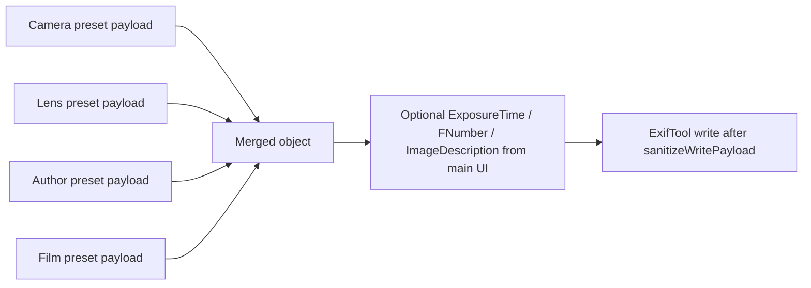

# EXIF tags, presets, and UI mapping

This document describes how EXIF tag names relate to **preset categories** (Camera, Lens, Film, Author), what gets **written to image files**, and where values appear in the **ExifMod UI**.

Implementation references:

- Merge and sanitization: `src/main/exifCore/store.ts` (`mergeSelectedPayloads` strips `Film` / `Film Maker` only; raw user Copyright), `src/main/exifCore/pure.ts` (`sanitizeWritePayload` at ExifTool apply, `buildApplyCommand`)
- Constants: `src/main/exifCore/constants.ts` (`CONTROL_FIELDS`, `WRITE_EXCLUDED_FIELDS`)
- Main grid / commit: `src/renderer/src/App.tsx` (`buildMergedPayloadForState`, metadata table, notes, shutter/aperture)
- “Current” column hints: `src/renderer/src/exif/infer.ts` (`inferCategoryValues`, exposure/aperture helpers)
- Preset editor forms: `src/renderer/src/PresetEditor.tsx`

---

## How preset payloads become EXIF

1. Each preset stores a JSON **`payload`** of tag names → values (EXIF field names as used by ExifTool, e.g. `Make`, `Model`, `Keywords`).
2. **Camera** presets also store **`lens_system`**, **`lens_mount`**, **`lens_adaptable`** in the database. These drive **lens compatibility** in the UI; they are **not** written as EXIF tags named `LensSystem` / `LensMount` / `LensAdaptable` (see below).
3. When applying metadata, **`mergePayloads`** loads the selected Camera, Lens, Author, and Film presets and merges their JSON payloads in this order: **Camera → Lens → Author → Film**. If the same tag appears in more than one preset, **later categories win** (last write wins).
4. **`readConfigPayload`** drops keys in **`CONTROL_FIELDS`** (`LensSystem`, `LensMount`, `LensAdaptable`) from stored JSON before merge, so those names never enter the merged write payload from preset JSON.
5. **`sanitizeWritePayload`** removes **`Film`** and **`Film Maker`** from whatever is about to be written, so those keys are **never** passed to ExifTool from the merged payload (they may still exist in stored preset JSON for catalog / legacy reasons).

After that merge, the main window can add **`ExposureTime`**, **`FNumber`**, and **`ImageDescription`** from the editing controls (see below).

---

## Tags stored in preset JSON by category (Preset Editor)

These are the fields the **New / Edit preset** dialogs edit (`PresetEditor.tsx`). Values are saved in `payload_json` unless noted as DB-only.

| EXIF / payload key | Camera | Lens | Film | Author | Notes |
| ------------------ | :----: | :--: | :--: | :----: | ----- |
| `Make` | ✓ | | | | Camera body make |
| `Model` | ✓ | | | | Camera body model |
| `LensMake` | ✓ (fixed lens only) | ✓ | | | UI: “Lens Make” (legacy `Lens` in old presets is migrated to `LensMake` on load) |
| `LensModel` | ✓ (fixed lens only) | ✓ | | | UI: “Lens Model”; legacy `LensID` in old presets is migrated to `LensModel` on load when model was empty |
| `ISO` | | | ✓ | | Shown as **ISO** in the Film preset dialog |
| `Keywords` | | | ✓ (array) | | **Not** edited as raw keywords in the UI. The Film preset dialog asks for **Film stock** then **ISO**; the app builds `Keywords` for EXIF (see [Film stock and EXIF Keywords](#film-stock-and-exif-keywords)) |
| `Artist`, `Creator` | | | | ✓ | UI **Author Name**; one value is written to **both** tags |
| `Copyright` | | | | ✓ | UI **Copyright (optional)** — stored value is **user text only**; on EXIF write it becomes `© {currentYear} {user text}`. Empty means no Copyright tag |
| `Author` | | | | ✓ | Always set to **`Person`** on save (fixed; not a dialog field) |

**DB-only (not in `payload_json` as tag keys for merge):**

| Field | Camera | Lens | Purpose |
| ----- | :----: | :--: | ------- |
| `lens_system` | ✓ | | Interchangeable vs fixed lens (UI + lens list rules) |
| `lens_mount` | ✓ | ✓ | Mount name (UI + filtering) |
| `lens_adaptable` | ✓ | | “Accepts adapters” (Camera interchangeable only) |

Lens presets **no longer** save `ExposureTime` or `FNumber` in the editor; any legacy values are stripped when saving or loading a Lens preset (`PresetEditor.tsx`).

### Author preset dialog (order)

1. **Preset Name** — database / list name (all categories).
2. **Author Name** → EXIF **`Artist`** and **`Creator`** (same string in both). Catalog display names use **`Creator`** / **`Artist`** (see `displayNameForRecord`).
3. **Copyright (optional)** — user-entered suffix only. When metadata is **written to files**, `sanitizeWritePayload` (`src/main/exifCore/pure.ts`) sets EXIF **Copyright** to `© {current calendar year} {trimmed user text}`. If the field is empty, **Copyright** is not written.

On every Author preset save, **`Author`** is set to the literal string **`Person`** (ExifTool tag `Author`), in addition to the fields above. Legacy **`Author Name`** in stored JSON is migrated into **Artist**/**Creator** on load and no longer saved. Legacy **Creator** vs **Artist** values are unified on load when they differ.

The Author preset dialog shows a **hint** under the Copyright field with the exact string that will be written (or that no Copyright will be written). **Preview EXIF changes** uses the same formatting for the merged payload display.

---

## Film stock and EXIF Keywords

ExifMod treats **EXIF `Keywords`** as the bridge between **film stock identity** and **preset / catalog** behavior. The **Film** preset dialog asks only for **Film stock** and **ISO** (in that order); it does **not** ask users to edit “keywords” directly. The app composes the `Keywords` array when saving and when inferring **Current** from files.

### What we store and write

- **`ISO`** — plain string in the preset payload (same tag on write when merged).
- **`Keywords`** — string array. The app always includes a literal token **`film`** (lowercase) as a **marker** meaning “this image is tagged as film / analog.” Additional tokens describe the stock (one or more comma‑separated pieces in the UI, each becomes its own keyword after `film`).

Example payload shape:

```json
{
  "ISO": "400",
  "Keywords": ["film", "Kodak Portra 400"]
}
```

If the user leaves **Film stock** empty, the saved preset still has `Keywords: ["film"]` so the marker remains consistent.

### How the catalog builds the film preset **name**

`src/main/exifCore/store.ts` (`filmNameFromKeywords`, `displayNameForRecord` for `film`):

1. Read `Keywords` as either a single string or an array of strings (ExifTool may return either).
2. Require at least one token equal to **`film`** (case‑insensitive). If missing, the derived film name is empty.
3. Take the **first keyword that is not** `film` as the **stock name** (trimmed).
4. Append **` (ISO …)`** when `ISO` is non‑empty, e.g. `Portra 400 (ISO 400)`.

So the **list label** for a film preset is driven by **stock name + ISO**, not by raw keyword editing.

### How **“Current”** matches a file to the **Film** row

`src/renderer/src/exif/infer.ts` (`inferCategoryValues`):

1. Load keyword tokens from metadata (`Keywords` string or array).
2. Require the **`film`** marker; collect all other tokens as candidate **stock hints** (order preserved).
3. Compare those hints to **`catalog.film_values`** entries (film preset display names). Catalog entries may look like `Name (ISO 400)`; the code parses optional ` (ISO …)` suffixes to disambiguate when file metadata **ISO** matches.
4. Matching order: exact base name + ISO match if both present → exact base name → substring / fuzzy between hint and catalog base name.

So files must carry **`film` in Keywords** (plus stock tokens) for the Film **Current** cell to resolve to a catalog preset name; the preset editor ensures new presets write that structure.

### UI summary (Film preset modal)

| Dialog field   | Maps to payload        | Becomes on write (merged)      |
| -------------- | ---------------------- | ------------------------------ |
| **Film stock** | drives `Keywords`      | `Keywords`: `["film", …tokens]` |
| **ISO**        | `ISO`                  | `ISO`                          |

Comma‑separated **Film stock** input is split into separate keywords (e.g. `Acme, 400` → `["film","Acme","400"]`) so matching stays aligned with multi‑token keywords in files.

---

## Tags never written from merged preset payload

| Key | Reason |
| --- | ------ |
| `LensSystem`, `LensMount`, `LensAdaptable` | Stripped on read from preset JSON (`CONTROL_FIELDS`); mount/adapt/system live in DB columns for Camera/Lens |
| `Film`, `Film Maker` | Stripped before ExifTool (`WRITE_EXCLUDED_FIELDS`) |

---

## Main window: Metadata pane (staging)

After merging the four preset selections, the app may add:

| Tag | Source | UI label (English) |
| --- | ------ | ------------------ |
| Preset merge result | Selected Camera / Lens / Film / Author presets | Shown indirectly via **Preset** column dropdowns and **Preview EXIF changes** |
| `ExposureTime` | Manual “Shutter Speed” field (non-empty) | Shutter Speed |
| `FNumber` | Manual aperture field (non-empty) | Aperture (f-stop) |
| `ImageDescription` | Notes textarea when changed from loaded baseline | Notes |

Empty shutter/aperture fields mean **do not write** those tags.

---

## “Current” column (inferred from file metadata)

The **Current** column does not read preset IDs; it **infers** display strings from ExifTool metadata for the staged file(s):

| Preset category | Inference (simplified) | Relevant metadata keys (see `inferCategoryValues`) |
| ---------------- | ------------------------ | --------------------------------------------------- |
| Camera | `Model`, else `Make` | `Model`, `Make` |
| Lens | `LensModel`, else `Lens` | `LensModel`, `Lens` |
| Film | See [Film stock and EXIF Keywords](#film-stock-and-exif-keywords); `film` marker + stock tokens vs `film_values` | `Keywords`, `ISO`, catalog list |
| Author | First non-empty of `Author Name`, `Creator`, `Artist` | Same keys (see Author preset dialog above); `Author` is not used for this hint |

**Shutter / aperture “current”** rows use `exposureTimeRawFromMetadata` / `fnumberRawFromMetadata` (e.g. `ExposureTime`, `FNumber`, or composite tags when present).

---

## Preview EXIF changes

Shows the **full merged JSON** that would be written for each file (preset merge + optional `ExposureTime` / `FNumber` / `ImageDescription`), after the same validation as commit.

---

## Quick reference: merge order



---

*Last updated to match the codebase at the time of writing; if behavior changes, update this file and the referenced modules.*
