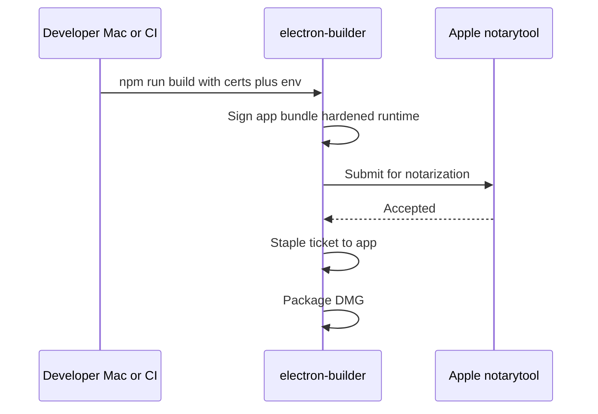

# macOS signing and notarization for EXIFmod

Process guide for producing a **Gatekeeper-trusted** macOS build (Developer ID + notarization). This document is **not** a substitute for Apple’s current documentation—verify certificate and `notarytool` details against [Apple Developer](https://developer.apple.com/documentation/security/notarizing-macos-software-before-distribution) and [electron-builder](https://www.electron.build/) when you implement signing.

## Prerequisites (Apple side)

- **Apple Developer Program** membership (paid). You need a **Team ID** (10-character string, visible in [developer.apple.com](https://developer.apple.com) Membership or Certificates).
- **Developer ID Application** certificate: create in Certificates, Identifiers & Profiles → Certificates → **Developer ID Application** (not “Mac Development” or Mac App Store). Install the downloaded `.cer` into Keychain and ensure the **private key** is present (usually created via Keychain Access CSR flow).
- **Notarization credentials** (pick one approach):
  - **App Store Connect API key** (recommended for CI): Keys → **App Manager** or **Developer** role; download `.p8`, note **Issuer ID**, **Key ID**. Used with `xcrun notarytool` / electron-builder’s notarize flow.
  - **Apple ID + app-specific password**: Apple ID account → Sign-In and Security → **App-Specific Passwords** (legacy path; still works with `notarytool` in some setups).

## What the repo does today

[package.json](../package.json) `build` already sets `appId` (`dev.ay.exifmod`), `productName` (`EXIFmod`), `mac.target: ["dmg"]`, and `release/` output. **There is no signing, hardened runtime, entitlements, or notarization config yet**—`npm run build` produces a local DMG that is **ad-hoc** or unsigned for distribution outside your machine.

electron-builder **v25** (see [package.json](../package.json)) bundles tooling that can sign and drive **notarytool** (Apple deprecated `altool`).

## Recommended build pipeline (high level)

1. **Sign** the `.app` inside `release/` with your **Developer ID Application** identity and **hardened runtime** (required for notarization).
2. **Notarize** the signed artifact (typically the app bundle or the zip/dmg as required by your script—electron-builder usually notarizes the app before final DMG, depending on config).
3. **Staple** the notarization ticket so offline Gatekeeper validation works.
4. Ship the **DMG** (and optionally verify with `spctl` / `stapler validate`).

## Configuration work in this project (to implement)

| Area | Purpose |
| ---- | ------- |
| **`build.mac.hardenedRuntime: true`** | Required for notarization. |
| **Entitlements files** (e.g. `build/entitlements.mac.plist` + `entitlements.mac.inherit.plist`) | Electron needs specific entitlements (e.g. **com.apple.security.cs.allow-jit**, **…disable-library-validation** for native modules). Start from [Electron code signing](https://www.electronjs.org/docs/latest/tutorial/code-signing) and tighten for production. |
| **`build.mac.identity`** | Explicit **Developer ID Application: Your Name (Team ID)** string, or rely on `CSC_NAME` / automatic detection if only one ID cert is in keychain. |
| **Notarization** | Add `mac.notarize` (or an `afterSign` hook using `@electron/notarize`) with `teamId` and API key path / env vars per electron-builder docs. |
| **CI secrets** | Store cert + `.p8` + passwords as encrypted secrets; on CI, import cert into a temporary keychain (common pattern). |

Exact JSON keys vary slightly by electron-builder version—use the **electron-builder macOS code signing guide** for v25 when implementing.

## Local build steps (after config exists)

1. Ensure **Xcode Command Line Tools** (`xcode-select --install`) so `codesign`, `notarytool`, `stapler`, `xcrun` are available.
2. Export env vars (example set—names may match electron-builder expectations): `CSC_LINK` / `CSC_KEY_PASSWORD` if using a **.p12** export, or rely on **login keychain** with the Developer ID cert installed; plus **notarytool** credentials (`APPLE_API_KEY`, `APPLE_API_KEY_ID`, `APPLE_API_ISSUER` for API key flow, or Apple ID + app-specific password where supported).
3. Run **`npm run build`** (runs `electron-vite build` then `electron-builder` per [package.json](../package.json) scripts).
4. **Verify** on another Mac (or clean user): open DMG, drag app to Applications, first launch should not show “damaged” / unidentified developer if signing + notarization + staple succeeded. Commands: `codesign -dv --verbose=4` on the app, `spctl -a -vv /path/to/EXIFmod.app`, `stapler validate` as appropriate.

## Operations and compliance

- **Privacy / export**: If you distribute outside the U.S., ensure privacy policy and (if applicable) export compliance match App Store Connect / your site—Developer ID distribution is **outside** the Mac App Store but still subject to Apple’s agreements.
- **Revocation**: Keep certs and keys secure; if compromised, revoke in Apple portal and re-sign.
- **Updates**: Plan whether you will use in-app updates (e.g. **electron-updater**) later—separate from signing but affects how you host `latest-mac.yml` and sign update artifacts.

## Follow-up documentation

- After the project has concrete entitlements and env var names, add a short **“Release / macOS signing”** pointer in [README.md](../README.md) (no secrets in repo—reference env vars and Keychain setup only).

## Checklist

- [ ] Apple Developer Program, Team ID, **Developer ID Application** certificate, and notarization credentials (API key or app-specific password).
- [ ] electron-builder: hardened runtime, entitlements plists, `mac.identity`, `mac.notarize` (or `afterSign`); CI secrets if applicable.
- [ ] Document exact env vars and verify commands in README; never commit secrets or `.p8` files.

This guide is **process-oriented**; adding plist files and the `package.json` `mac` block is implementation work once certificates and notarization access are ready.
